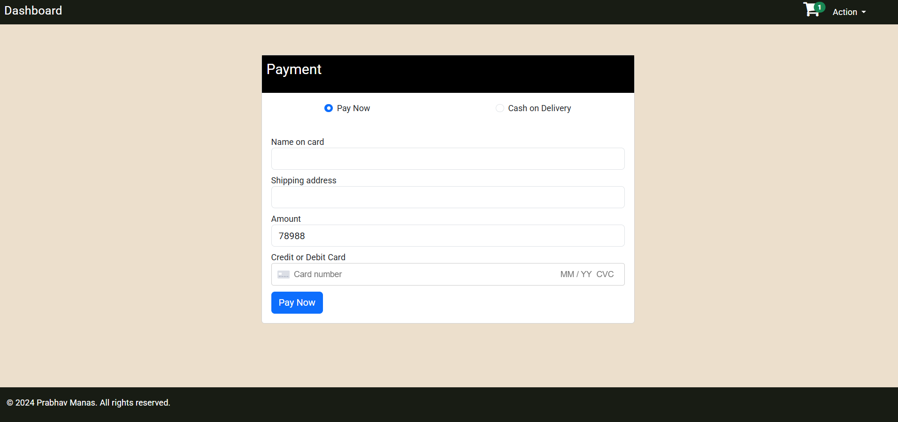

# E-comm App

A full-stack MEAN application for E-commerce Application that provides solution for seller to add, update or remove their product and for users who can navigate to the product details, add the product to the cart, place order and also make payment for the products and the respective seller would receive the order along with the payment status, delivery status and delivery address.

## Features

- User Authentication and Authorization including forgot password & reset password
- Separate dashboards for Seller & User
- Product Listing & CRUD Operations
- Image Uploads
- Add to cart functionality at user end
- Checkout page for efficient payments or COD
- Order History for users
- RESTful APIs using MongoDB & Express.js
- Responsive UI

## Tech Stack

**Frontend**: Angular 16, CSS, Bootstrap, Typescript
**Backend**: Node.js, Express.js
**Database**: MongoDB Atlas
**Authentication & Authorization**: JSON Web Token (JWT)

## Screenshots

### Log in Page


### Sign up Page


### User-Dashboard


### Seller-Dashboard


### Order-History


### Checkout Page


💳 **Test Card Info** (for demo/testing purposes):  
Use card number: `4242 4242 4242 4242`  
Expiry: Any future date  
CVC: Any 3 digits  
ZIP: Any 5 digits

## Installations

### Clone the repo
```bash
git clone https://github.com/Prabhav-Manas/E-comm-App.git
cd E-comm-App

cd backend
npm install
npm start

cd frontend
npm install
ng serve

The app will be available at http://localhost:4200